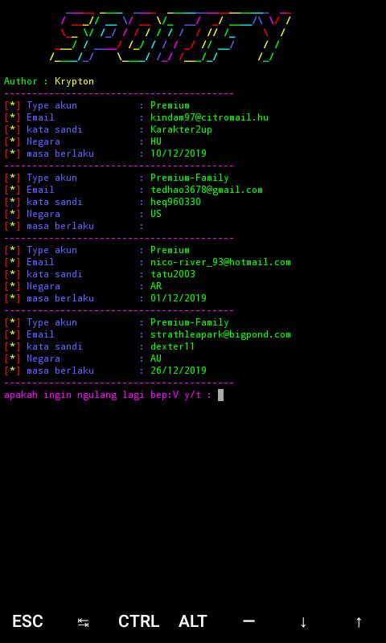

# Spotify-Premium 
<b>$pkg install </b><i>python2 -y</i> 
<b>$pkg install </b><i>git -y </i> 
<b>$pip2 install</b><i> requests</i> 
<b>$git </b><i>clone https://github.com/puja04122003/Spotify-Premium</i> 
<b>$cd </b><i>Spotify-Premium</i> 
<b>$python2 </b><i>spotify.py</i> 
<b>#SCREENSHOT</b> 

